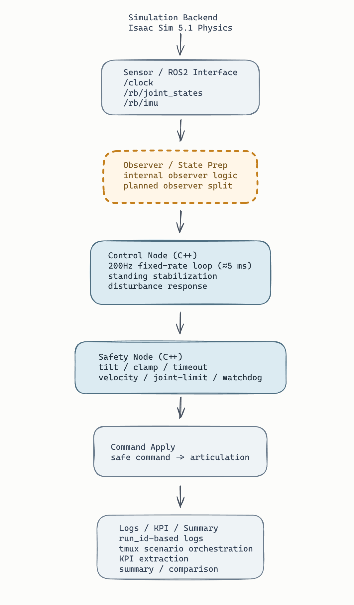
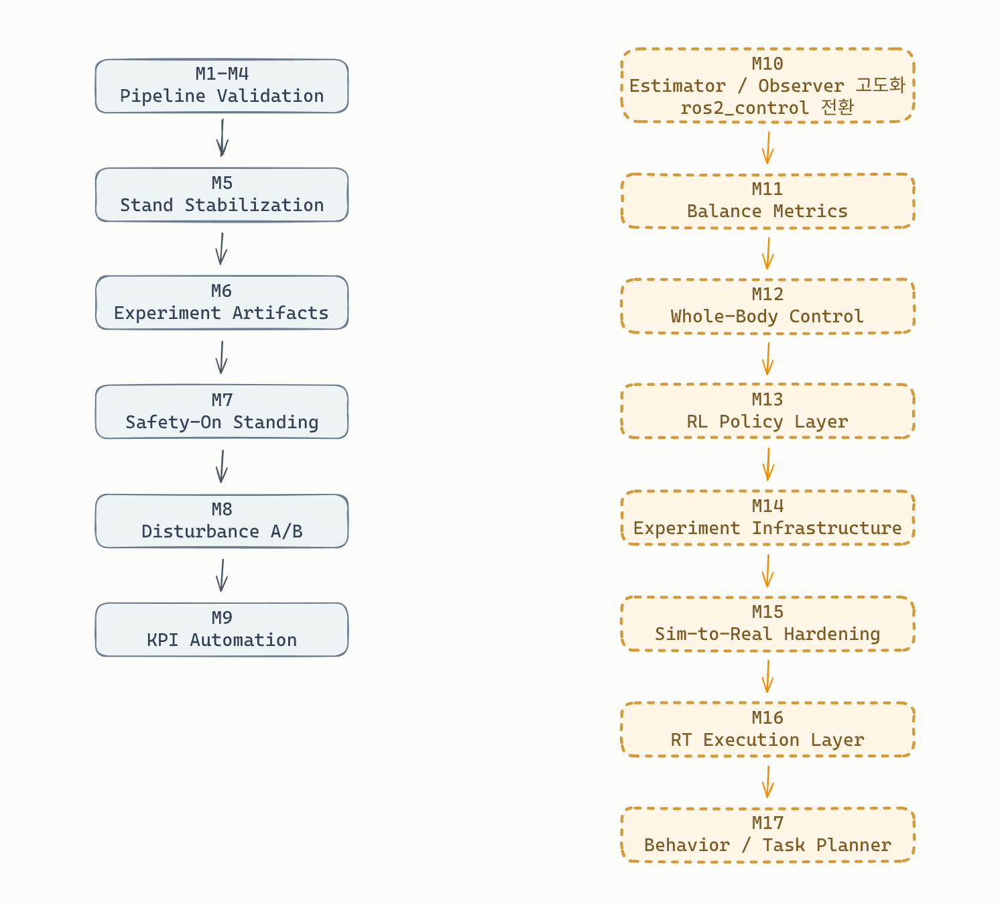

# RB_Humanoid_Control

Isaac Sim 5.1 + ROS2 Humble 기반으로, 휴머노이드 제어 경로를
`센서 -> 추정/관측 -> 제어(C++) -> 안전 -> 로그/KPI` 구조로 설계하고 검증한 Sim-to-Real 포트폴리오 프로젝트입니다.

핵심 목표는 "시뮬에서만 잠깐 도는 데모"가 아니라,
**실기체 백엔드로 바꿔도 유지될 인터페이스와 검증 습관을 갖춘 제어 스택**을 만드는 것입니다.

## 빠른 링크

- 최종 시연영상: [GitHub inline demo](https://github.com/user-attachments/assets/4e70156b-aca6-4c3a-859f-7526fa2f511e)
- 한 장 요약: [reports/sim2real/ONE_PAGER.md](reports/sim2real/ONE_PAGER.md)
- 기술 복기: [reports/sim2real/overview.md](reports/sim2real/overview.md)
- 현재 실험 기록: [STATUS.md](STATUS.md)
- 전체 로드맵: [MASTER_PLAN.md](MASTER_PLAN.md)

## 현재 핵심 성과

- ROS2 메인 트랙 기준 M1~M4 재검증 완료
  - safety reason: `CLAMP`, `JOINT_LIMIT`, `TIMEOUT`, `TILT`, `VELOCITY_LIMIT`
- M5 no-disturbance standing에서 **controller-only 장시간 hold** 확보
- M7 safety-on standing에서 **`CONTROL_ACTIVE` 기준 60초 no-fall / no-safety-reason** 확인
- M8 disturbance A/B에서 **`113N x 0.10s` 고정 외란 기준 `OFF 3/3 fall`, `ON 3/3 no-fall`** 확인
- M9 KPI/report 자동화 완료
  - `M8 raw -> M9 summary` 분리
  - `balance_off_kpi.json`, `balance_on_kpi.json`, `comparison.json`, `summary.md`, `m9/index.csv` 자동 생성
- standing 실패의 핵심 원인 분리 완료
  - 문제: gain 부족보다 **`imu_link` 축을 control/body frame처럼 직접 읽던 해석 불일치**
  - 해결: publisher 수정이 아니라 observer 쪽 **`imu_frame_mode=g1_imu_link` 보정**

## 내가 만든 것

- `rb_controller`: 200Hz C++ control loop와 dt/jitter 관측
- `rb_safety`: watchdog / tilt / clamp / velocity gating safety layer
- `tmux/tmuxp`: 재현 가능한 실험 오케스트레이션
- `M8 raw -> M9 summary`: KPI 자동 요약 파이프라인
- `imu_frame_mode=g1_imu_link`: observer-side IMU frame correction
- Stage1 baseline과 Sim2Real main track 분리 운영

## 시스템 구조

아래 구조를 기준으로 `센서 / observer / controller / safety / KPI`를 한 흐름으로 연결했습니다.

- `Isaac Sim -> ROS2 sensor interface -> observer/state prep -> C++ controller -> safety -> command apply -> logs/KPI` 흐름으로 구성했습니다.
- 현재는 observer 로직이 control stack 내부에 붙어 있지만, 다음 단계 `M10`에서 observer / estimator 책임을 더 분리할 계획입니다.
- 핵심은 구조가 분리된 상태에서 standing, disturbance, KPI까지 같은 경로로 검증됐다는 점입니다.

## 고정한 엔지니어링 결정

- Isaac Sim 5.1 / ROS2 Humble / Ubuntu 22.04
- Command mode: `effort`
- Namespace: `/clock` + `/rb/*`
- Timing: `control_rate_hz=200`, `sim.dt=0.005`, `substeps=1`, `decimation=1`
- Joint ordering source: `ros2_ws/src/rb_bringup/config/joint_order_g1.yaml`
- Main path: `original G1 direct spawn + standalone World.step()`

## 마일스톤을 이 순서로 진행한 이유

제어 프로젝트는 바로 "잘 서는지"부터 보면 어디가 잘못됐는지 분리하기 어렵습니다.
그래서 이 프로젝트는 **센서 -> 제어 루프 -> 명령 적용 -> 안전 -> standing -> disturbance -> KPI** 순서로 쌓았습니다.

- **M0 결정 잠금**
  - 토픽, 조인트 순서, command mode가 바뀌면 이후 결과가 전부 흔들리기 때문
- **M1 센서 경로 확인**
  - `/clock`, `/rb/joint_states`, `/rb/imu`가 안 오면 나머지는 전부 무의미하기 때문
- **M2 제어 루프 확인**
  - fixed-rate controller와 dt/jitter 관측이 있어야 "제어가 돌았다"를 증명할 수 있기 때문
- **M3 명령 적용 확인**
  - controller 계산값이 실제 articulation에 적용되는지 분리 확인해야 하기 때문
- **M4 safety 분리 검증**
  - controller를 맹신하지 않고 마지막에 safety layer가 개입하는 구조를 증명해야 하기 때문
- **M5 standing**
  - 센서/루프/적용/안전이 확인된 뒤에야 "왜 못 서는지"를 진짜 제어 문제로 좁힐 수 있기 때문
- **M8 disturbance / M9 KPI**
  - "선다"와 "같은 외란에서 실제로 더 잘 버틴다"는 다른 문제이고, 그 차이를 숫자로 정리해야 포트폴리오 증빙이 되기 때문

## 마일스톤별 구현과 검증

| 단계 | 무엇을 했는가                                       | 무엇으로 검증했는가                                                   | 증빙                                                                                                                                                                                                                                                                                                                                                                                                                                                                                                                      |
| ---- | --------------------------------------------------- | --------------------------------------------------------------------- | ------------------------------------------------------------------------------------------------------------------------------------------------------------------------------------------------------------------------------------------------------------------------------------------------------------------------------------------------------------------------------------------------------------------------------------------------------------------------------------------------------------------------- |
| M1   | `/clock`, `/rb/joint_states`, `/rb/imu` 브리지 확인 | topic publish 확인                                                    | [m1_standalone.png](reports/sim2real/images/standalone_backend/m1_standalone.png)                                                                                                                                                                                                                                                                                                                                                                                                                                         |
| M2   | `rb_controller` 200Hz loop, dt/jitter 출력          | `/rb/command_raw`, `dt_mean/p95/max`                                  | [m2_controller_standalone.png](reports/sim2real/images/standalone_backend/m2_controller_standalone.png)                                                                                                                                                                                                                                                                                                                                                                                                                   |
| M3   | command apply 경로 연결                             | `joint_states` before/after 변화                                      | [m3_command_standalone.png](reports/sim2real/images/standalone_backend/m3_command_standalone.png)                                                                                                                                                                                                                                                                                                                                                                                                                         |
| M4   | safety gating 구조 정리                             | `CLAMP`, `JOINT_LIMIT`, `TIMEOUT`, `TILT`, `VELOCITY_LIMIT` 개별 증빙 | [m4_clamp_standalone.png](reports/sim2real/images/standalone_backend/m4_clamp_standalone.png), [m4_joint_limit_standalone.png](reports/sim2real/images/standalone_backend/m4_joint_limit_standalone.png), [m4_timeout_standalone.png](reports/sim2real/images/standalone_backend/m4_timeout_standalone.png), [m4_tilt_standalone.png](reports/sim2real/images/standalone_backend/m4_tilt_standalone.png), [m4_velocity_limit_standalone.png](reports/sim2real/images/standalone_backend/m4_velocity_limit_standalone.png) |
| M5   | controller-only standing hold 확보, 실패 원인 분리  | `fall_event`, `sync_markers`, `loop_stats`, GUI 관찰                  | [stand_pd_sanity.yaml](ros2_ws/src/rb_controller/config/scenarios/stand_pd_sanity.yaml), [reports/sim2real/overview.md](reports/sim2real/overview.md)                                                                                                                                                                                                                                                                                                                                                                     |
| M7   | safety-on standing 재통합                           | `NO_FALL_EVENT`, `NO_SAFETY_REASON`, `CONTROL_ACTIVE` 기준 60초 hold  | [stand_pd_safecheck.yaml](ros2_ws/src/rb_controller/config/scenarios/stand_pd_safecheck.yaml), [m7_stand_safecheck.yaml](ops/tmuxp/m7_stand_safecheck.yaml), [m7_t0.png](reports/sim2real/images/standalone_backend/m7_t0.png), [m7_t60.png](reports/sim2real/images/standalone_backend/m7_t60.png)                                                                                                                                                                                                                       |
| M8   | 같은 외란에서 balance feedback OFF/ON 비교          | `fall_event`, `disturb_kpi`, 대표 still 이미지, split-screen 영상     | [stand_pd_balance_base.yaml](ros2_ws/src/rb_controller/config/scenarios/stand_pd_balance_base.yaml), [run_m8_pair.sh](ops/run_m8_pair.sh), [m8_disturb_tilted.png](reports/sim2real/images/standalone_backend/m8_disturb_tilted.png), [m8_disturb_recovered.png](reports/sim2real/images/standalone_backend/m8_disturb_recovered.png)                                                                                                                                                                                     |
| M9   | M8 결과 자동 요약/비교                              | `kpi.json`, `comparison.json`, `summary.md`, `m9/index.csv`           | [extract_m8_kpi.py](scripts/sim2real/extract_m8_kpi.py), [run_m9_kpi.sh](ops/run_m9_kpi.sh), [run_m8_and_m9.sh](ops/run_m8_and_m9.sh)                                                                                                                                                                                                                                                                                                                                                                                     |

## M5에서 실제로 해결한 문제

초기 M5 standing은 아무리 gain을 만져도 `1~2초` 안쪽에서 계속 전방 붕괴했습니다.
raw IMU/bias/tilt observability를 추가해서 보니, 실제 forward fall 정보가 controller `pitch` 채널이 아니라 `roll` 쪽으로 들어오고 있었습니다.

즉 IMU가 고장난 게 아니라, **`imu_link` 기준 축을 controller가 기대한 body/control frame 축처럼 곧바로 읽고 있던 것**이 핵심 문제였습니다.
이후 observer에 `imu_frame_mode=g1_imu_link` 보정을 넣자 controller-only no-disturbance standing hold가 장시간 유지되기 시작했습니다.

## 검증 범위와 다음 단계

아래 그림의 왼쪽은 **현재 검증 완료 범위**, 오른쪽은 **이후 engineering 확장 단계**입니다.

- 현재 검증 완료 범위:
  - `M1~M4 pipeline validation`
  - `M5 standing stabilization`
  - `M6 evidence / artifacts`
  - `M7 safety-on standing`
  - `M8 disturbance A/B`
  - `M9 KPI automation`
- 다음 engineering 단계:
  - `M10 observer / estimator`
  - `M11 balance metrics`
  - `M12 whole-body control`
  - `M13 RL policy layer`
  - `M14 experiment infrastructure`
  - `M15 sim-to-real hardening`
  - `M16 RT execution`
  - `M17 behavior / task planner`

## 최종 시연영상

https://github.com/user-attachments/assets/4e70156b-aca6-4c3a-859f-7526fa2f511e

- 영상 구성: `before fail -> M7 standing -> M8 disturbance OFF/ON -> M9 KPI summary`
- 공개용 재생 자산: `GitHub user-attachments asset`

## 대표 증빙

### 문서

- 랜딩 요약: [reports/sim2real/ONE_PAGER.md](reports/sim2real/ONE_PAGER.md)
- 기술 복기: [reports/sim2real/overview.md](reports/sim2real/overview.md)
- 현재 작업 로그: [STATUS.md](STATUS.md)
- 전체 로드맵: [MASTER_PLAN.md](MASTER_PLAN.md)

### 대표 자산

- 최종 시연영상: [GitHub inline demo](https://github.com/user-attachments/assets/4e70156b-aca6-4c3a-859f-7526fa2f511e)
- 시스템 구조도: [system_architecture.png](reports/sim2real/images/standalone_backend/system_architecture.png)
- 검증 범위/다음 단계 도식: [milestone_roadview.png](reports/sim2real/images/standalone_backend/milestone_roadview.png)

### 대표 로그 아티팩트

- M5
  - `logs/sim2real/m5/20260314-121949_m5_stand_sanity_qrefv7/m5/fall_event.txt`
  - `logs/sim2real/m5/20260314-121949_m5_stand_sanity_qrefv7/m5/sync_markers.txt`
  - `logs/sim2real/m5/20260314-121949_m5_stand_sanity_qrefv7/m5/loop_post_sync.txt`
- M7
  - `logs/sim2real/m7/20260314-133954_m7_stand_safecheck/m7/fall_event.txt`
  - `logs/sim2real/m7/20260314-133954_m7_stand_safecheck/m7/reason_count.txt`
  - `logs/sim2real/m7/20260314-133954_m7_stand_safecheck/m7/sync_markers.txt`
  - `logs/sim2real/m7/20260314-133954_m7_stand_safecheck/m7/loop_post_sync.txt`
- M8
  - `logs/sim2real/m8/20260314-184316/`
  - `logs/sim2real/m8/20260314-184442/`
  - `logs/sim2real/m8/20260314-184609/`
- M9
  - `logs/sim2real/m9/20260315-000113/balance_off_kpi.json`
  - `logs/sim2real/m9/20260315-000113/balance_on_kpi.json`
  - `logs/sim2real/m9/20260315-000113/comparison.json`
  - `logs/sim2real/m9/20260315-000113/summary.md`
  - `logs/sim2real/m9/index.csv`

## 현재 진행 상태 (2026-03-18)

- M0 Decision Lock: 완료
- M1 Sensor Pipeline: 완료
- M2 C++ Controller Skeleton: 완료
- M3 Command Apply: 완료
- M4 Safety Layer: 완료
- M5 Controller-only standing hold: 완료
- M6 Evidence / Artifact Infrastructure: 완료
- M7 Safety-on standing: 완료
- M8 Disturbance A/B: 대표 고정 외란 조건 기준 완료
- M9 KPI / Report Automation: 완료
- 공개용 figure / video / README 세트 동기화: 완료

## 다음 단계

- M10: Estimator / Observer 고도화
- M11: Balance Metrics
- small cleanup: `reason_count.txt` raw parsing 정리

## Baseline / Archive

- Stage1 overview: [reports/stage1/overview.md](reports/stage1/overview.md)
- Stage1 one-pager: [reports/stage1/ONE_PAGER.md](reports/stage1/ONE_PAGER.md)
