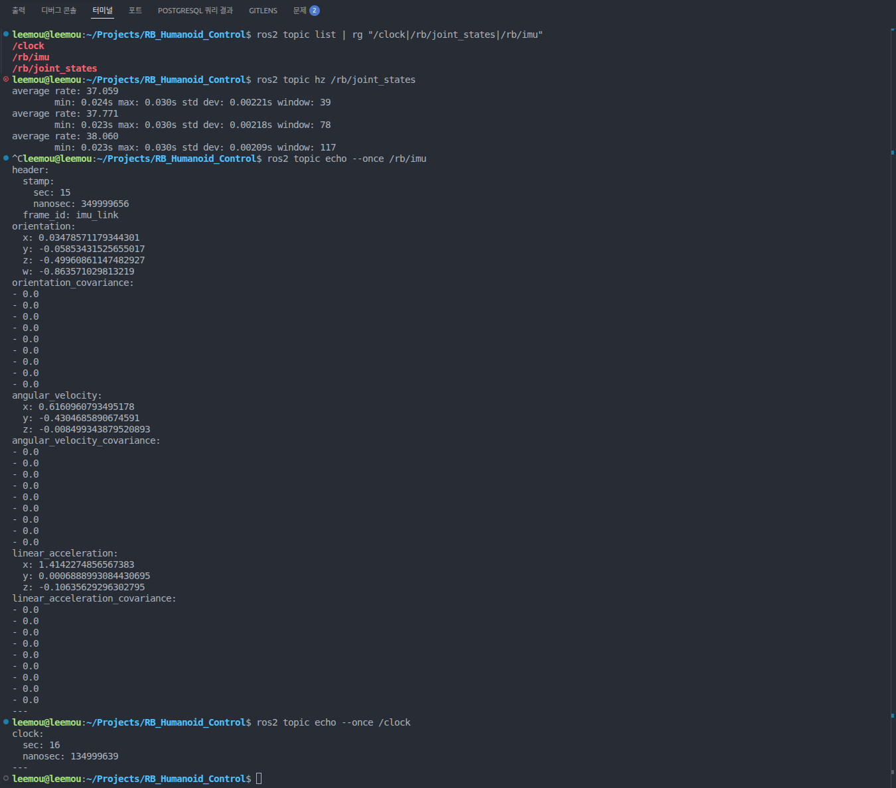
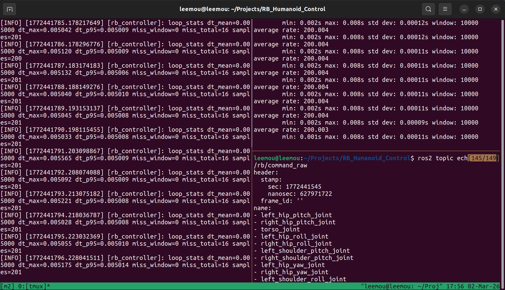
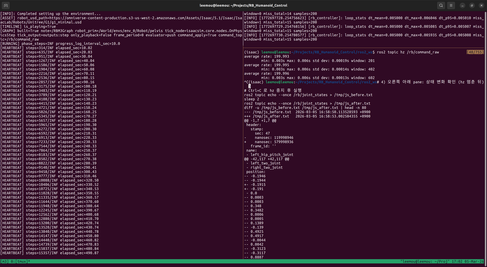
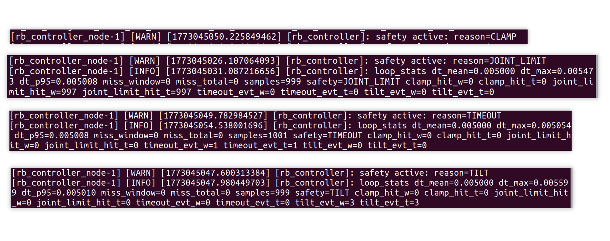

# RB_Humanoid_Control

## Portfolio Summary
Isaac Sim 5.1 + ROS2 Humble 기반으로, 휴머노이드 제어 경로를  
`센서 -> 추정 -> 제어(C++) -> 안전 -> KPI` 구조로 설계/검증하는 Sim-to-Real 포트폴리오 프로젝트.

핵심 목표는 "시뮬에서만 동작"이 아니라, 실기체 백엔드로 교체 가능한 인터페이스를 고정하고 수치로 증명하는 것이다.

## What I Built
- ROS2 파이프라인 중심 아키텍처 설계 (`/clock`, `/rb/joint_states`, `/rb/imu`, `/rb/command`)
- C++ controller 중심 트랙(200Hz, dt/jitter 계측 포함)으로 확장 가능한 구조
- Safety gating, KPI 로깅, 리포트 자동화까지 연결되는 마일스톤 기반 개발 체계
- Stage1 baseline과 Sim2Real main track 분리 운영

## System Architecture
```text
Isaac Sim (ROS2 Bridge)
  -> /clock, /rb/joint_states, /rb/imu
  -> rb_state_estimator
  -> rb_controller (C++/rclcpp, 200Hz, dt/jitter telemetry)
  -> rb_safety_monitor
  -> /rb/command
  -> rb_kpi_logger
```

## Engineering Decisions (Locked)
- Isaac Sim 5.1 / ROS2 Humble / Ubuntu 22.04
- Command mode: `effort`
- Namespace: `/clock` + `/rb/*`
- Timing: `control_rate_hz=200`, `sim.dt=0.005`, `substeps=1`, `decimation=1`
- Joint ordering source: `ros2_ws/src/rb_bringup/config/joint_order_g1.yaml`

## Evidence
- Sim2Real overview: `reports/sim2real/overview.md`
- Sim2Real one-pager: `reports/sim2real/ONE_PAGER.md`
- M1 proof image: `reports/sim2real/images/legacy_backend/m1.png`
- M2 proof image: `reports/sim2real/images/legacy_backend/m2_controller.png`
- M3 proof image: `reports/sim2real/images/legacy_backend/m3_command.png`
- M4 proof image: `reports/sim2real/images/legacy_backend/m4_safety.png`
- Saved stage USD (로컬 전용, git 미추적): `sim/isaac_scenes/g1_stage.usd`
- Stage1 overview: `reports/stage1/overview.md`
- Stage1 one-pager: `reports/stage1/ONE_PAGER.md`
- Current status: `STATUS.md`
- Master plan (SSOT): `MASTER_PLAN.md`

## M1 Snapshot


## M2 Snapshot


## M3 Snapshot


## M4 Snapshot


## Current Progress (2026-03-09)
- M0 Decision Lock: complete
- M1 Sensor Pipeline: complete
- M2 C++ Controller Skeleton: complete
- M3 Command Apply: complete
- M4 Safety Layer: complete
- Active sprint: M5
- Re-apply gate: M6 complete
- Re-apply deadline target: 2026-03-26

## Next Milestones
- M5: stand stabilization (20~30s)
- M6: KPI/report automation
